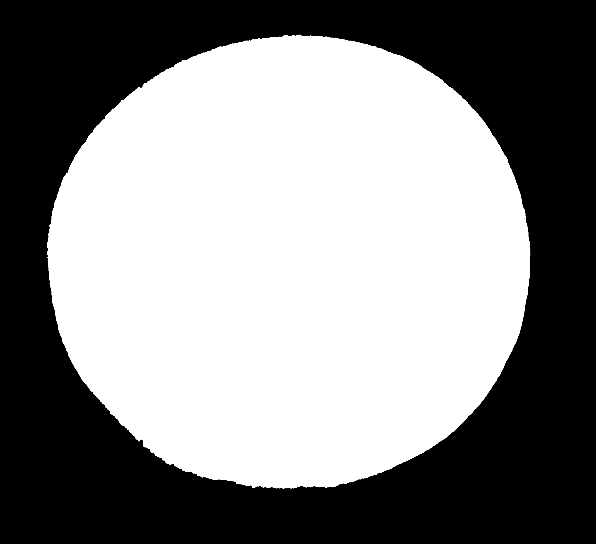
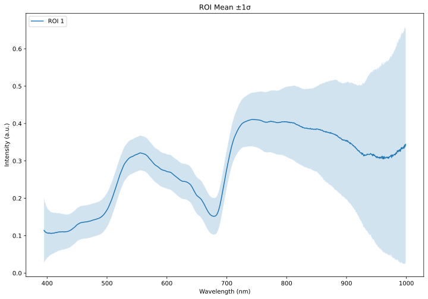
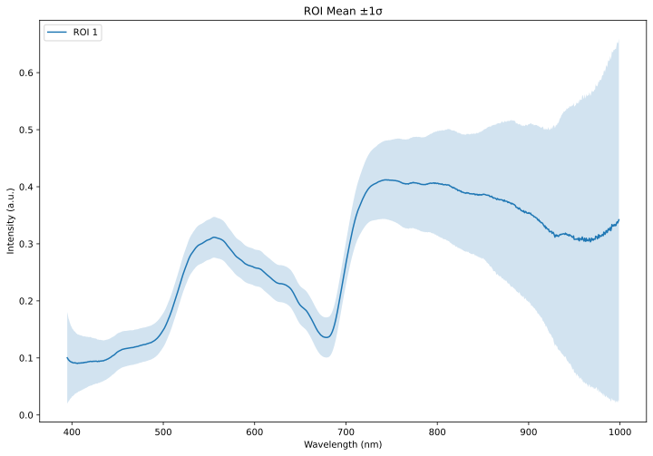
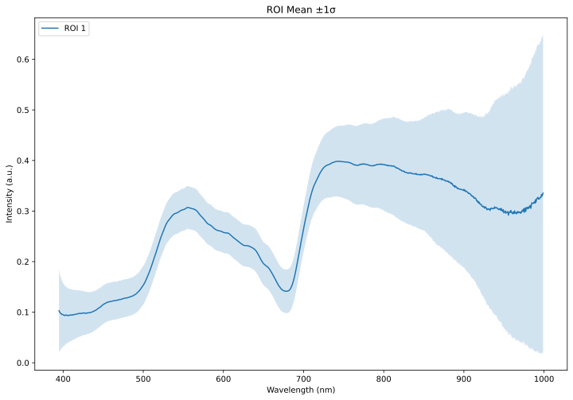
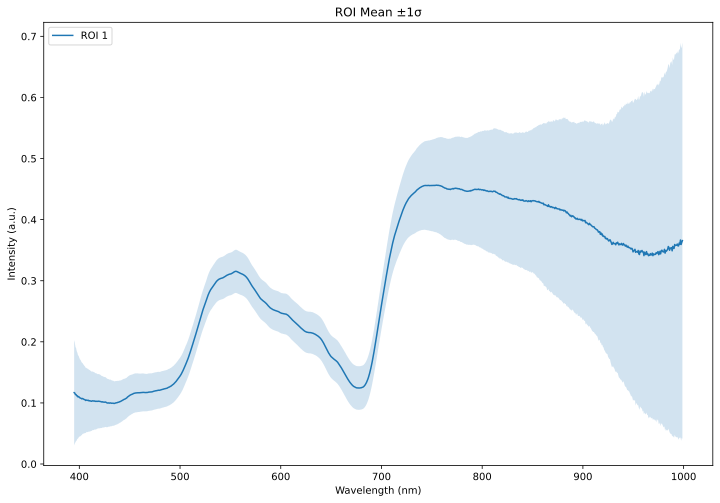

# HyperBird Microscopic Imaging Robot

HyperBird is a high-throughput hyperspectral microscopic imaging platform for plant phenotyping, combining robotic sample scanning with automated spectral-image processing and analysis.

<p align="center">
  
</p>

<p align="center">
  <a href="assets/hyperbird_in_action.mp4"></a>
</p>

<p align="center"><a href="assets/hyperbird_in_action.mp4"><strong>▶ Open full video (MP4)</strong></a></p>

## Contents

| Folder | Description |
| ------ | ----------- |
| [`hyperbird-proto/`](hyperbird-proto/) | Scanner control (Linux C++, motion + camera, ENVI output). |
| [`hyperbird-studio/`](hyperbird-studio/) | Processing, calibration, analysis (watchers, segmentation, notebooks). |
| [`data_examples/`](data_examples/) | Example processed outputs for demos. |
| [`assets/`](assets/) | README media (photos, GIF preview, MP4). |

## Sample images

RGB renderings generated from hypercube.

<table>
  <tr>
    <td align="center"><b>002-white</b><br></td>
    <td align="center"><b>003-DMTSLeaf1</b><br></td>
    <td align="center"><b>004-DMTSLeaf1</b><br></td>
  </tr>
  <tr>
    <td align="center"><b>005-DMTSLeaf1</b><br></td>
    <td align="center"><b>006-DMTSLeaf2</b><br></td>
    <td align="center"><b>007-DMTSLeaf2</b><br></td>
  </tr>
  <tr>
    <td align="center"><b>008-DMTSLeaf2</b><br></td>
    <td align="center"><b>009-DMTSLeaf2</b><br></td>
    <td align="center"><b>010-DMTSLeaf3</b><br></td>
  </tr>
</table>

### Masks

Segmentation overlays on RGB.

<table>
  <tr>
    <td align="center"><b>002-white</b> (mask)<br></td>
    <td align="center"><b>003-DMTSLeaf1</b><br></td>
    <td align="center"><b>004-DMTSLeaf1</b><br></td>
  </tr>
  <tr>
    <td align="center"><b>005-DMTSLeaf1</b><br></td>
    <td align="center"><b>006-DMTSLeaf2</b><br></td>
    <td align="center"><b>007-DMTSLeaf2</b><br></td>
  </tr>
  <tr>
    <td align="center"><b>008-DMTSLeaf2</b><br></td>
    <td align="center"><b>009-DMTSLeaf2</b><br></td>
    <td align="center"><b>010-DMTSLeaf3</b><br></td>
  </tr>
</table>

### Mean spectra
 
 ROI mean ± std.

<table>
  <tr>
    <td align="center"><b>002-white</b><br></td>
    <td align="center"><b>003-DMTSLeaf1</b><br></td>
    <td align="center"><b>004-DMTSLeaf1</b><br></td>
  </tr>
  <tr>
    <td align="center"><b>005-DMTSLeaf1</b><br></td>
    <td align="center"><b>006-DMTSLeaf2</b><br></td>
    <td align="center"><b>007-DMTSLeaf2</b><br></td>
  </tr>
  <tr>
    <td align="center"><b>008-DMTSLeaf2</b><br></td>
    <td align="center"><b>009-DMTSLeaf2</b><br></td>
    <td align="center"><b>010-DMTSLeaf3</b><br></td>
  </tr>
</table>

## Author

- **Jinhong Yu**
- Cornell AgriTech, Cornell University
- Contact: `jy773@cornell.edu`

## Publication and Citation

If you use this repository, please cite the HyperBird manuscript.

### Citation (plain text)

Yu, J., Brewer, A., Pippi, L., Hosseinzadeh, S., Moreno, J., Martinez, D., Chen, C., Gold, K. M., Cadle-Davidson, L., and Jiang, Y. HyperBird: A hyperspectral microscopic imaging robot for high-throughput plant phenotyping.

### Citation (BibTeX)

```bibtex
@article{yu_hyperbird,
  title   = {HyperBird: A Hyperspectral Microscopic Imaging Robot for High Throughput Plant Phenotyping},
  author  = {Yu, Jinhong and Brewer, Aliyah and Pippi, Lorenzo and Hosseinzadeh, Saeed and Moreno, Javier and Martinez, Dani and Chen, Chang and Gold, Kaitlin M. and Cadle-Davidson, Lance and Jiang, Yu},
  journal = {TBD},
  year    = {TBD},
  volume  = {TBD},
  number  = {TBD},
  pages   = {TBD},
  doi     = {TBD}
}
```
