# HyperBird Microscopic Imaging Robot

HyperBird is a high-throughput hyperspectral microscopic imaging platform for plant phenotyping, combining robotic sample scanning with automated spectral-image processing and analysis.

<p align="center">
  
</p>

<p align="center">
  <a href="assets/hyperbird_in_action.mp4"></a>
</p>

<p align="center"><a href="assets/hyperbird_in_action.mp4"><strong>▶ Open full video (MP4)</strong></a></p>

## Contents

| Folder | Description |
| ------ | ----------- |
| [`hyperbird-proto/`](hyperbird-proto/) | Scanner control (Linux C++, motion + camera, ENVI output). |
| [`hyperbird-studio/`](hyperbird-studio/) | Processing, calibration, analysis (watchers, segmentation, notebooks). |
| [`data_examples/`](data_examples/) | Example outputs: **`leaf_samples_dpi0_processed`** (0 DPI) and **`leaf_samples_dpi6_processed`** (6 DPI). |
| [`assets/`](assets/) | README media (photos, GIF preview, MP4). |

## Sample images

RGB renderings from the hypercube ([`leaf_samples_dpi0_processed`](data_examples/leaf_samples_dpi0_processed) vs [`leaf_samples_dpi6_processed`](data_examples/leaf_samples_dpi6_processed)).

<div align="center">

<table width="70%">
  <tr>
    <th align="center">002-white</th>
    <th align="center">003-DMTSLeaf1</th>
    <th align="center">004-DMTSLeaf1</th>
    <th align="center">005-DMTSLeaf1</th>
    <th align="center">006-DMTSLeaf3</th>
  </tr>
  <tr>
    <td align="center">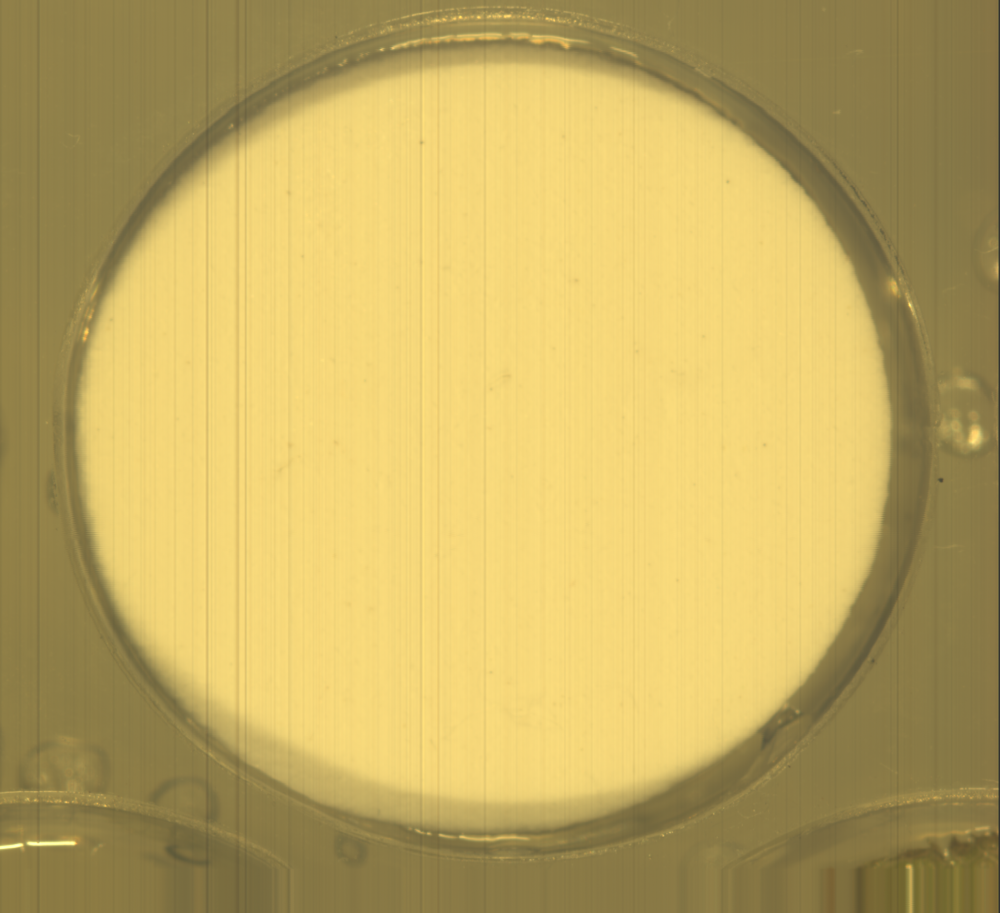</td>
    <td align="center"></td>
    <td align="center"></td>
    <td align="center"></td>
    <td align="center"></td>
  </tr>
  <tr>
    <td align="center">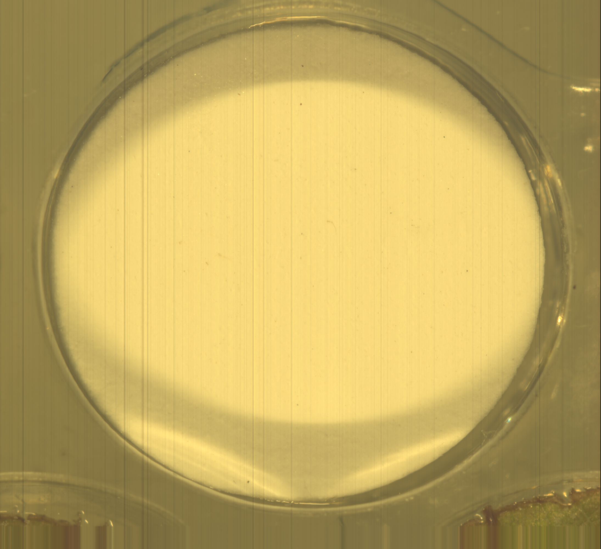</td>
    <td align="center"></td>
    <td align="center"></td>
    <td align="center"></td>
    <td align="center"></td>
  </tr>
</table>

</div>

### Masks

Segmentation overlay.

<div align="center">

<table width="70%">
  <tr>
    <th align="center">002-white</th>
    <th align="center">003-DMTSLeaf1</th>
    <th align="center">004-DMTSLeaf1</th>
    <th align="center">005-DMTSLeaf1</th>
    <th align="center">006-DMTSLeaf3</th>
  </tr>
  <tr>
    <td align="center"></td>
    <td align="center"></td>
    <td align="center"></td>
    <td align="center"></td>
    <td align="center"></td>
  </tr>
  <tr>
    <td align="center">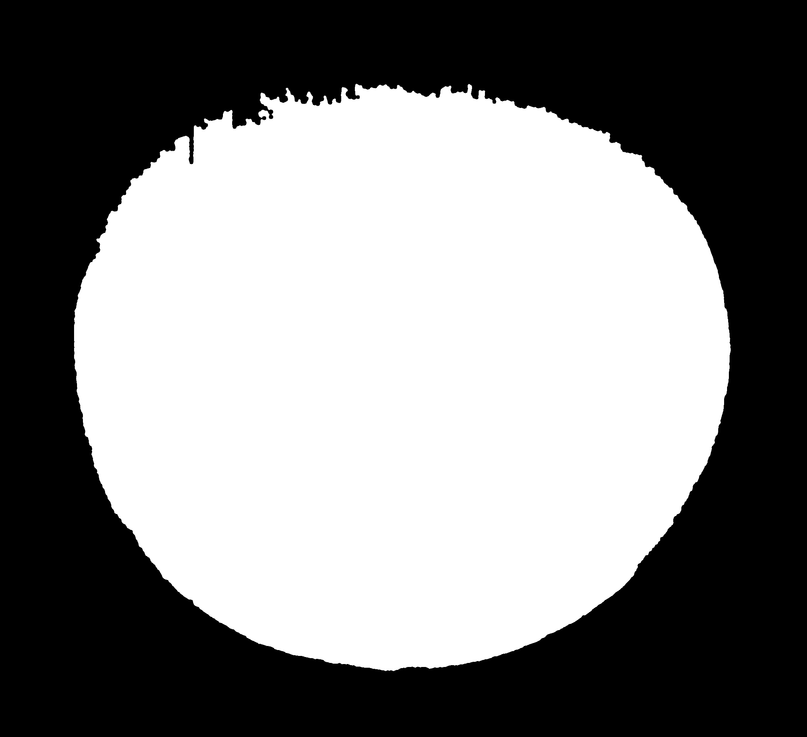</td>
    <td align="center"></td>
    <td align="center"></td>
    <td align="center"></td>
    <td align="center"></td>
  </tr>
</table>

</div>

### Mean spectra

ROI mean ± std. 

<div align="center">

<table width="70%">
  <tr>
    <th align="center">002-white</th>
    <th align="center">003-DMTSLeaf1</th>
    <th align="center">004-DMTSLeaf1</th>
    <th align="center">005-DMTSLeaf1</th>
    <th align="center">006-DMTSLeaf3</th>
  </tr>
  <tr>
    <td align="center">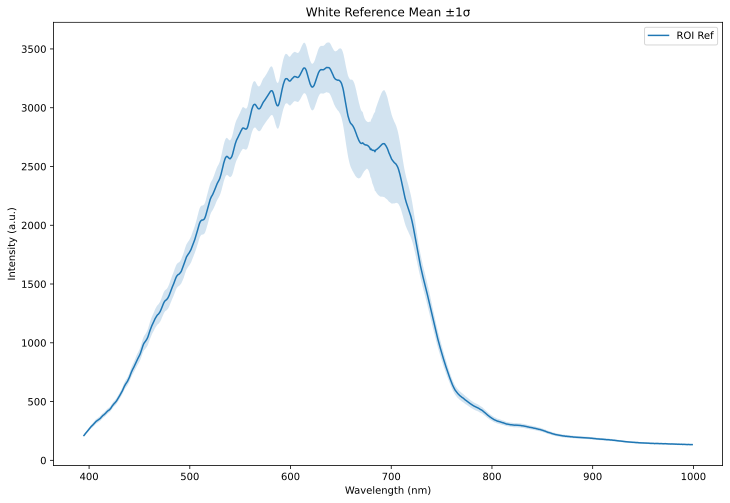</td>
    <td align="center">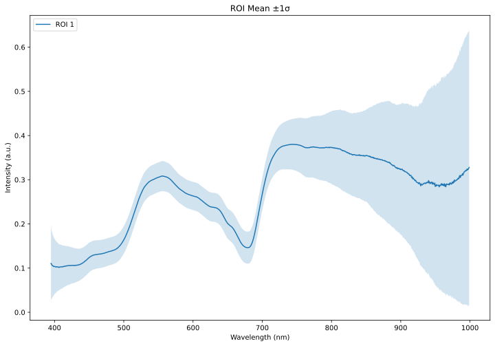</td>
    <td align="center">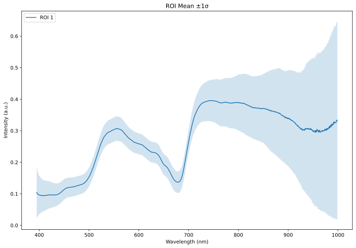</td>
    <td align="center"></td>
    <td align="center">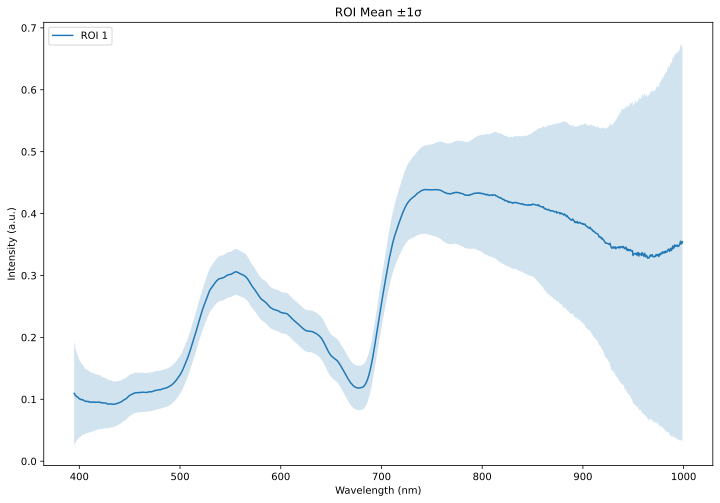</td>
  </tr>
  <tr>
    <td align="center">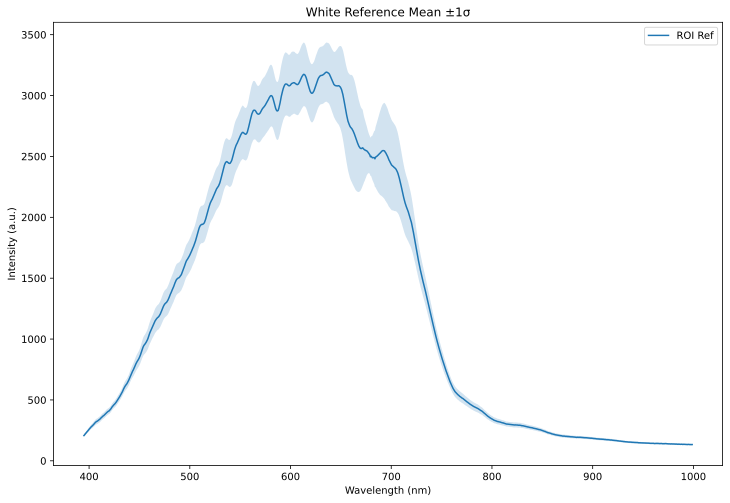</td>
    <td align="center">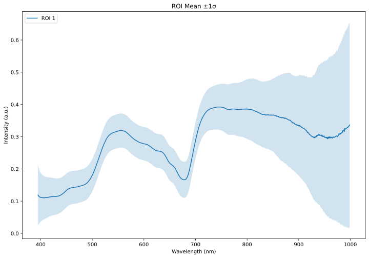</td>
    <td align="center">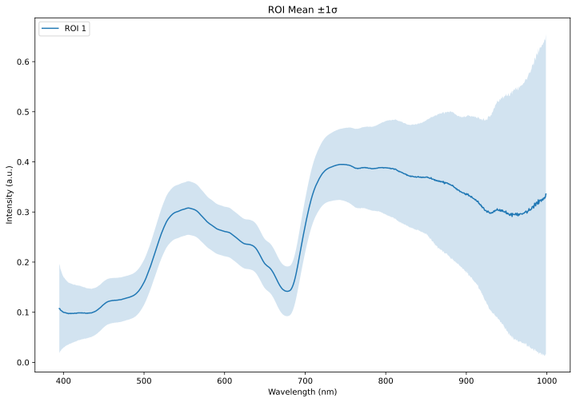</td>
    <td align="center">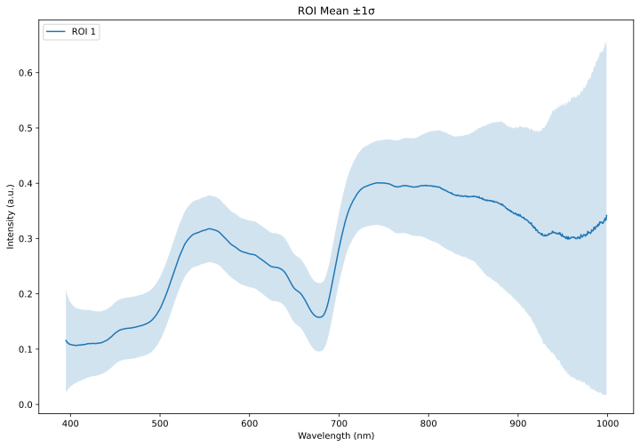</td>
    <td align="center">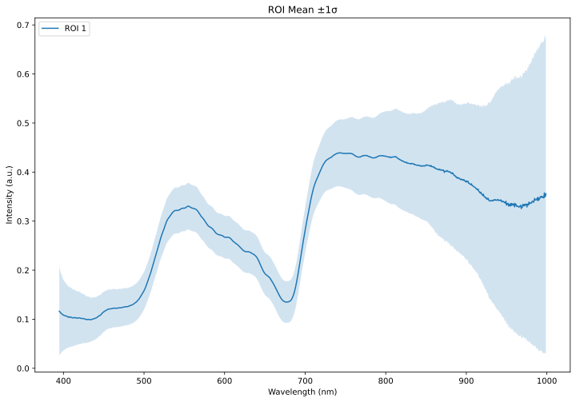</td>
  </tr>
</table>

</div>

## Author

- **Jinhong Yu**
- Cornell AgriTech, Cornell University
- Contact: `jy773@cornell.edu`

## Publication and Citation

If you use this repository, please cite the HyperBird manuscript.

### Citation (plain text)

Yu, J., Brewer, A., Pippi, L., Hosseinzadeh, S., Moreno, J., Martinez, D., Chen, C., Gold, K. M., Cadle-Davidson, L., and Jiang, Y. HyperBird: A hyperspectral microscopic imaging robot for high-throughput plant phenotyping.

### Citation (BibTeX)

```bibtex
@article{yu_hyperbird,
  title   = {HyperBird: A Hyperspectral Microscopic Imaging Robot for High Throughput Plant Phenotyping},
  author  = {Yu, Jinhong and Brewer, Aliyah and Pippi, Lorenzo and Hosseinzadeh, Saeed and Moreno, Javier and Martinez, Dani and Chen, Chang and Gold, Kaitlin M. and Cadle-Davidson, Lance and Jiang, Yu},
  journal = {TBD},
  year    = {TBD},
  volume  = {TBD},
  number  = {TBD},
  pages   = {TBD},
  doi     = {TBD}
}
```
